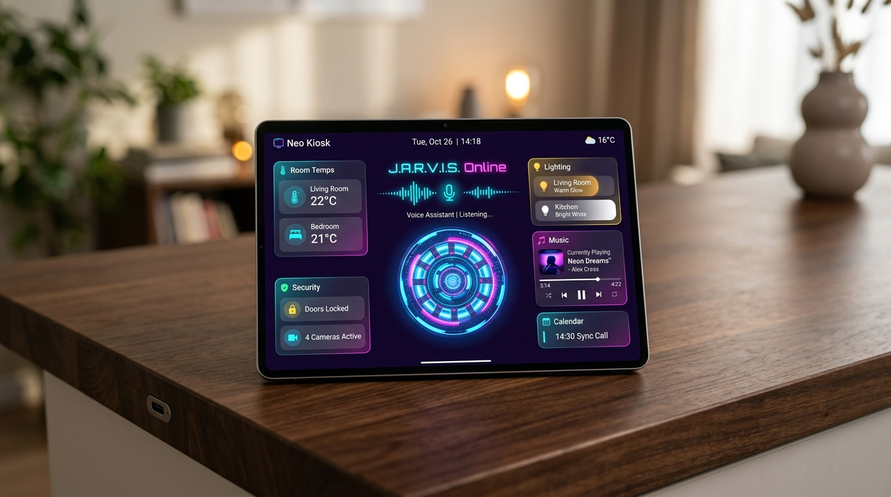

# Neo Kiosk 📱
> Eine hochoptimierte, futuristische Android-Kiosk-App zur perfekten Integration deines Smarthome-Dashboards mit vollem J.A.R.V.I.S.-Sprachassistenten-Support.

**Neo Kiosk** verwandelt jedes Android-Tablet in eine dedizierte Steuerungseinheit für dein Smart Home. Sie wurde speziell entwickelt, um die typischen Restriktionen und Sicherheitsblockaden von Standard-Android-WebViews (wie Google Chrome oder Fully Kiosk) bei lokalen Dashboards zu umgehen.

---

## 🌟 Warum Neo Kiosk? (Die Vorteile)

Klassische Browser und WebViews blockieren viele Funktionen, die für ein anspruchsvolles Smarthome-Dashboard essenziens sind. **Neo Kiosk löst diese Probleme nativ:**

*   **🎙️ J.A.R.V.I.S. Spracherkennungs-Brücke:** Android-WebViews besitzen standardmäßig keine Unterstützung für die Browser-Spracherkennung (`webkitSpeechRecognition`). Neo Kiosk injiziert automatisch ein JavaScript-Interface, das die Aufrufe abfängt und an den **nativen Spracherkennungsdienst des Android-Tablets** tunnelt.
*   **🔊 ElevenLabs & Audio-Blob-Fix:** WebViews blockieren das Abspielen von Audio-Blobs (`blob:http://...`) über HTML5-Audio-Elemente, da der native System-Player keinen Zugriff auf den Browser-Speicher hat. Neo Kiosk fängt diese Audio-Objekte ab, konvertiert sie in Base64 und spielt sie flüssig über den nativen Android `MediaPlayer` ab.
*   **🗣️ Lokale Sprachausgabe (TTS-Bridge):** Die Web-Sprachausgabe (`window.speechSynthesis`) ist in WebViews oft stumm oder deaktiviert. Unsere App tunnelt alle Vorlesebefehle direkt in die native Text-to-Speech-Engine von Android.
*   **🔒 Umgang mit selbstsignierten Zertifikaten:** Wenn das Dashboard über HTTPS mit einem selbstsignierten Zertifikat (`AUTO_SSL=true`) läuft, bricht WebView den Ladevorgang stillschweigend ab. Neo Kiosk bietet eine zuschaltbare Option, SSL-Fehler zu ignorieren.
*   **🎵 Mixed Content Audio-Streaming:** Erlaubt das Abspielen von unverschlüsselten HTTP-Streams (wie z.B. Fritzbox Internet-Radio oder WDR 2) auf einem verschlüsselten HTTPS-Dashboard.
*   **📷 Native Bewegungserkennung:** Die App nutzt die Frontkamera, um Bewegungen vor dem Tablet zu analysieren und das Display automatisch aus dem Standby aufzuwecken (ohne externe Bewegungsmelder).

---

## 🛠️ Feature-Übersicht

### 1. Tablet-Benutzeroberfläche
*   **Vollbild-WebView:** Keine störenden Systemleisten oder Statusbars.
*   **Wischgeste für Einstellungen:** Ein Wisch vom linken Bildschirmrand zur Mitte öffnet das Konfigurationsmenü.
*   **PIN-Schutz:** Das Einstellungsmenü kann optional mit einer PIN (Standard: `1234`) gesperrt werden, um unbefugten Zugriff zu verhindern.
*   **App schließen:** Ein Button im Einstellungsmenü erlaubt es, den Kiosk-Modus zu beenden und die App sauber zu schließen.
*   **Direktes Reload:** Aktualisiere das Dashboard direkt über das Menü.

### 2. Remote-Administration (Web-Oberfläche)
Die App startet einen lokalen Webserver (Port `8080`), über den das Tablet bequem vom PC aus verwaltet werden kann:
*   **Live-Status:** Anzeige von Akkustand, Ladestatus, freiem RAM und Display-Status.
*   **Display-Steuerung:** Bildschirm remote ein- oder ausschalten.
*   **Lautstärkeregelung:** Steuere die Systemlautstärke des Tablets.
*   **Sprachausgabe-Konsole:** Sende Texte, die das Tablet laut vorliest.
*   **Konfiguration:** Ändere die Dashboard-URL oder den SSL-Modus aus der Ferne.

---

## 🚀 Installation & Erste Schritte

1.  Lade die aktuelle **`neo-kiosk.apk`** aus den [GitHub Releases](https://github.com/Daddelgreis74/smarthome-kiosk/releases) herunter.
2.  Installiere die App auf deinem Android-Tablet (aktiviere bei Bedarf "Installation aus unbekannten Quellen").
3.  Erteile beim ersten Start die Berechtigungen für **Kamera** (für die Bewegungserkennung) und **Mikrofon** (für J.A.R.V.I.S.).
4.  **Fernverwaltung nutzen:**
    *   Öffne den Browser an deinem PC und navigiere zu: `http://<tablet-ip>:8080/`
    *   Melde dich mit dem Standard-Passwort **`admin`** an.
    *   Trage deine Dashboard-URL ein und klicke auf "Einstellungen speichern". Das Tablet lädt dein Dashboard sofort automatisch!

---

## 🛡️ Berechtigungen & Sicherheit
Die App benötigt folgende Android-Rechte:
*   `RECORD_AUDIO`: Für die J.A.R.V.I.S. Spracherkennung.
*   `CAMERA`: Für die lokale Bewegungserkennung (Bilder werden nur im RAM analysiert und **niemals** gespeichert oder übertragen).
*   `SYSTEM_ALERT_WINDOW` (Über anderen Apps einblenden): Für die Debug-Kameravorschau.
*   `WRITE_SETTINGS` / `DEVICE_POLICY_MANAGER`: Um das Display des Tablets hardwareseitig schlafen zu legen.
